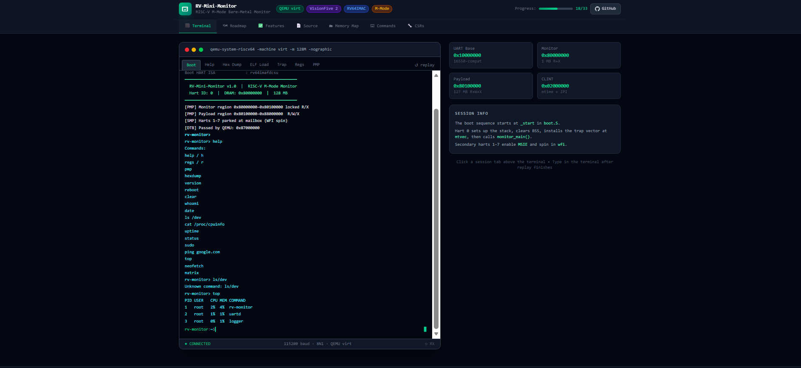

# RV-Mini-Monitor

Interactive RISC-V M-mode bare-metal monitor dashboard built with React, TypeScript, Vite, and Tailwind CSS.

This project combines a presentation-ready monitor UI with a live execution path:

`RISC-V C sample -> riscv64-linux-gnu-gcc -> qemu-riscv64 -> Node WebSocket -> React terminal`

## Features

- Interactive terminal emulator with monitor-style sessions
- Custom shell commands such as `help`, `regs`, `pmp`, `top`, `neofetch`, and `status`
- Boot sequence simulation, diagnostics, memory map, and system panels
- Live backend commands backed by QEMU and GDB
- VisionFive/QEMU-inspired dark dashboard UI
- Responsive layout with roadmap and feature tracking views

## Preview



## Live commands

Once the backend is running, these terminal commands use the real toolchain:

- `boot` runs the sample RISC-V ELF in QEMU and streams stdout
- `status` reports whether QEMU, the cross-compiler, and GDB are available
- `regs` captures a real GPR + PC dump through GDB
- `step` captures a short real instruction trace through GDB
- `mem` captures a real stack memory dump through GDB

The rest of the UI keeps the simulated monitor walkthroughs for presentation value.

## Tech stack

- React
- TypeScript
- Vite
- Tailwind CSS
- Node.js
- WebSocket (`ws`)

## Host setup

On Ubuntu:

```bash
sudo apt update
sudo apt install qemu-user gcc-riscv64-linux-gnu gdb-multiarch
```

On Windows, the backend also tries to use the toolchain from WSL if native binaries are not installed.

## Run locally

Install dependencies:

```bash
npm install
```

Start the backend in one terminal:

```bash
npm run server
```

Start the frontend in another terminal:

```bash
npm run dev
```

The sample RISC-V source used by the live pipeline lives at `server/riscv/hello.c`.
